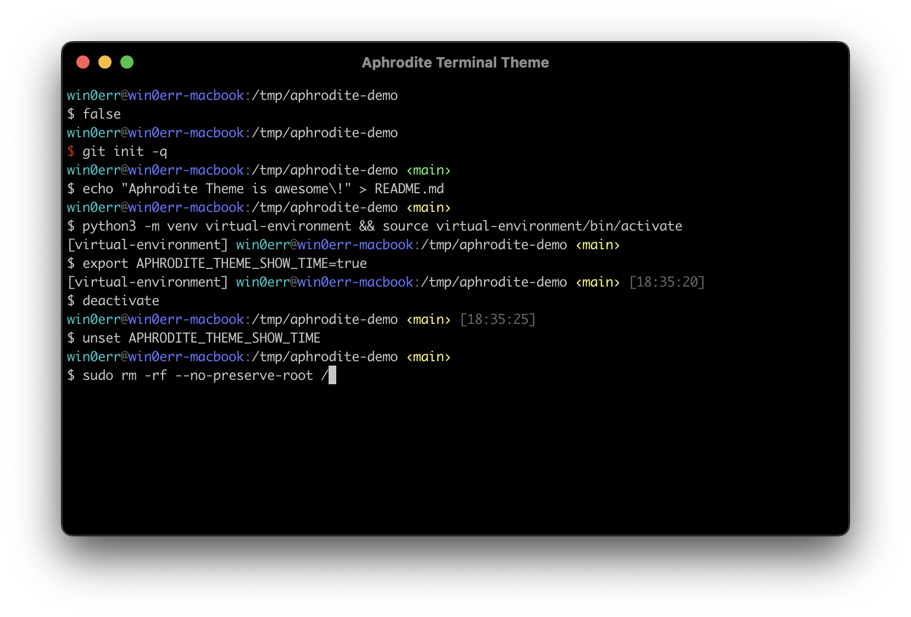

# Aphrodite Terminal Theme

Minimalistic Aphrodite theme does not have any visual noise. Displays only the necessary information: current user, hostname, working directory, git branch if exists.
Looks great both with dark and white terminals.



## Installation

### **fish** — the friendly interactive shell
1. Backup existing `fish_prompt.fish` file: `cp ~/.config/fish/functions/fish_prompt.fish{,.bak}`
2. Download prompt:
   ```sh
   wget -O ~/.config/fish/functions/fish_prompt.fish https://raw.githubusercontent.com/win0err/aphrodite-terminal-theme/master/fish/fish_prompt.fish
   ```
> **Author's notice:** Looks even cooler when theme is set to None `fish_config theme choose None` and autosuggestions are disabled `echo 'set -g fish_autosuggestion_enabled 0' >> ~/.config/fish/config.fish`.

### **zsh** — the Z shell

#### If you're using Oh My Zsh

1. Download theme:
   ```sh
   mkdir -p ~/.oh-my-zsh/custom/themes
   wget -O ~/.oh-my-zsh/custom/themes/aphrodite.zsh-theme https://raw.githubusercontent.com/win0err/aphrodite-terminal-theme/master/zsh/aphrodite.zsh-theme
   ```
2. Select theme using `omz`: `omz theme set aphrodite`
3. Reload current zsh session: `omz reload`

#### Without Oh My Zsh

1. Download theme to the themes directory, for example, `~/.zsh/themes`:
   ```sh
   mkdir -p ~/.zsh/themes
   wget -O ~/.zsh/themes/aphrodite.zsh-theme https://raw.githubusercontent.com/win0err/aphrodite-terminal-theme/master/zsh/aphrodite.zsh-theme
   ```
2. Select theme by sourcing it in `.zshrc`: `echo 'source ~/.zsh/themes/aphrodite.zsh-theme' >> ~/.zshrc`
3. Load theme immediately in current session: `source ~/.zsh/themes/aphrodite.zsh-theme`

### bash — GNU Bourne-Again SHell

1. Download theme to the themes directory, for example, `~/.bash/themes`:
   ```sh
   mkdir -p ~/.bash/themes
   wget -O ~/.bash/themes/aphrodite.theme.sh https://raw.githubusercontent.com/win0err/aphrodite-terminal-theme/master/bash/aphrodite.theme.sh
   ```
2. Select theme by sourcing it in `.bashrc`: `echo 'source ~/.bash/themes/aphrodite.theme.sh' >> ~/.bashrc`
3. Load theme immediately in current session: `source ~/.bash/themes/aphrodite.theme.sh`


---
_Developed by [Sergei Kolesnikov](https://github.com/win0err)_
